# iListUI 
###### Cool List 100% SwiftUI
[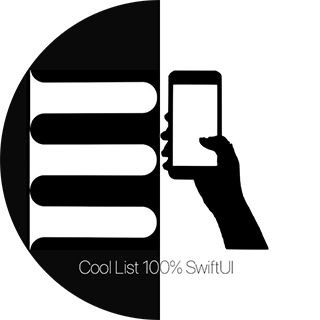](https://github.com/ssuperw/iListUI)
## Changelog 
#### 1.0.0
- [x] Basic List displaying mocked data
- [x] Two different cell design for compact and expand view (featured)
- [x] Cells context menu to show actions
- [x] Implemented .onDelete cell left swipe 
- [x] Basic details view accesing by NavigationLink
- [x] Options for filter and sorting presented in iOS13 modal view style
- [x] Persistence options using UserDefaults and @ObservableObject
- [x] Clean design respecting dark mode
##### Screenshots
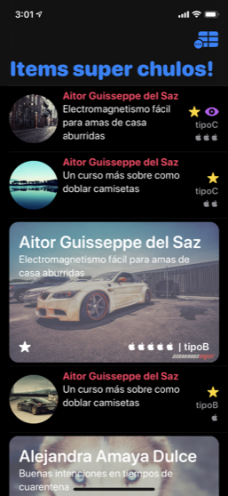|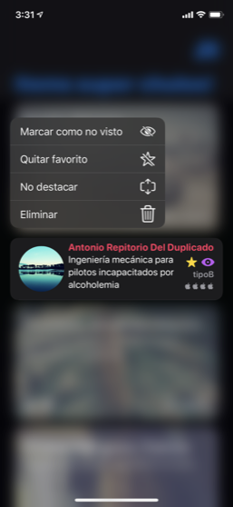|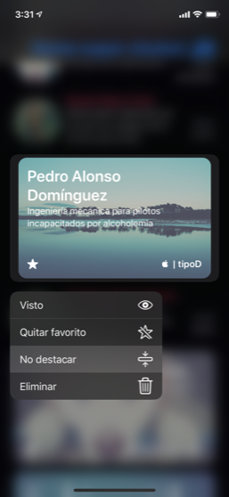|
|-|-|-|
|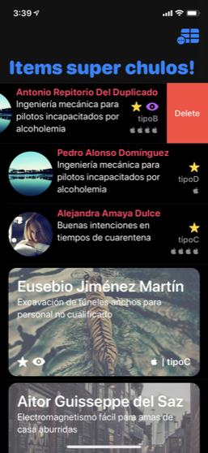|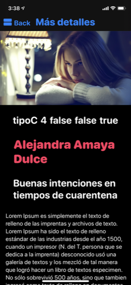|
|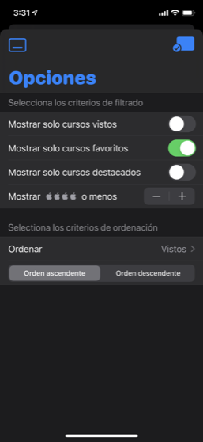|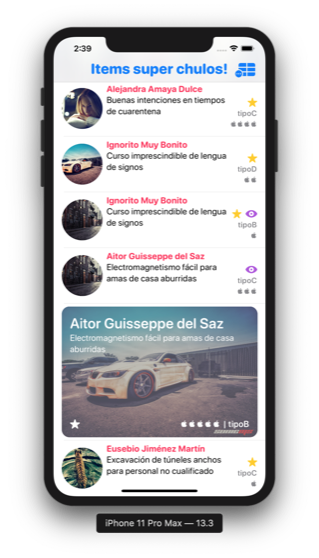|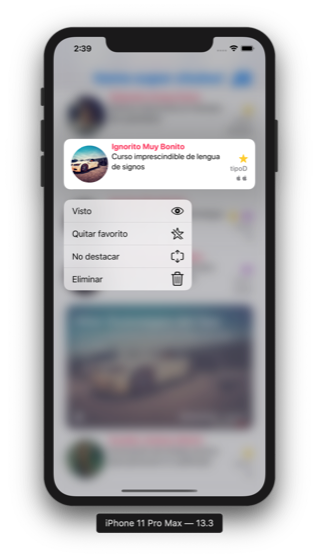|
|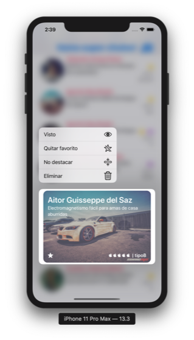|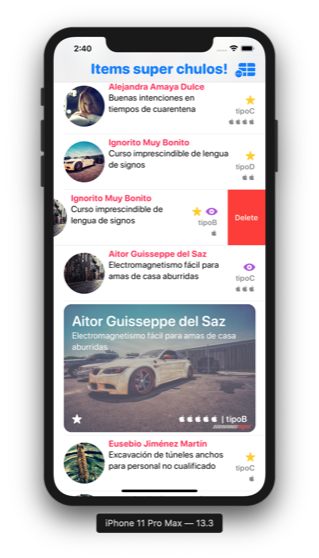|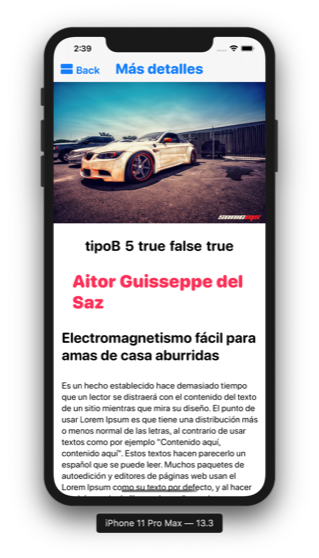|
|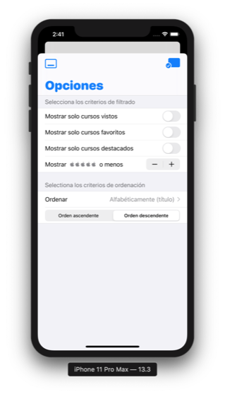|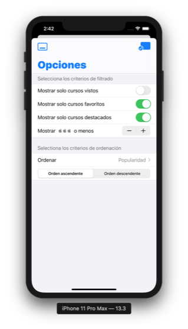|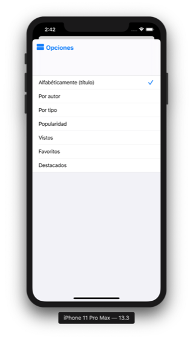|
