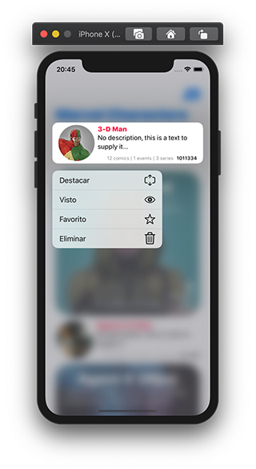

# myHeroes
|||
|-|-|
||This is a **SwiftUI** List App implemented with a **MVVM architecture** -  using the *[Marvel Characters API][apiMarvel]* - Please, feel free to comment, feedback are welcome. *(note for Marvel comics fans: Sorry for the Batman shape in this project, this was not done on purpose)* - *"Data provided by Marvel. © 2014 Marvel"*|

### Screenshots
|LaunchScreen|First App Screen|Empty List - While Loading|
|:-:|:-:|:-:|
|||")|
||||

|List View|Context Menu|Cell Swipe left (.onDelete)|
|:-:|:-:|:-:|
|||")|
|||")|

|List View|Detail View Empty Segmented List|Detail View|
|:-:|:-:|:-:|
||||
||||
> *"Data provided by Marvel. © 2014 Marvel"*|

## Changelog
### 1.0.1
- [x] Added some Unitary **Test** for SortingType and ImageLoader
- [x] Moved `@EnvironmentObject` from ListView to ViewModel and let the View logic free, this changes the way to *[initialize ViewModel in SwiftUI][viewModelSwiftUI] (depencency injection)*
- [x] Now *the early "loading lists…" screen* are nearly identical to Launch Screen as *[Human Interface Guidelines][appleHumanLaunchScreen] Apple recomendation*
- [x] Created methods to get a time stamp and and the hash checksum to can reuse this code
- [x] Take out getUrls methods from ViewModel to ApiConfig
- [x] Take out code from `init()` - navigationBar appearance config was moved to a method
- [x] Split configuration for App and for the API (webservice)
- [x] Removed commented code, console message and some unused images
- [x] Rearranged code by Features, Common, etc…

### 1.0.0
- [x] Filtering and sorting List by all fields and store this options via UserDefaults using an `@EnvironmentObject`
- [x] Handle webservice errors and display it to user when list is empty
- [x] Using **Alamofire Pod** instead URLSession
- [x] Cool transparent navigationBar design with customs bar buttons
- [x] Two different cell type, standard and featured, that can be dynamically switched between them
- [x] Cell Views with transitions and loaded with animation
- [x] Sheet modal presented to show Options Screen
- [x] DetailView designed with a large header with a photo ignoring safe area edges that fits full screen and
- [x] A Segmented Control (using a picker) to show three different Lists (comics, event and series) for a Character
- [x] Updated LaunchScreen to **works fine with Dark and Light modes**

##### Base project from *[here][iList]*

[//]: # (links)

   [iList]: <https://github.com/ssuperw/iListUI>
   [myHeroes]: <https://github.com/ssuperw/myHeroes>
   [apiMarvel]: <https://developer.marvel.com/docs>
   [appleHumanLaunchScreen]: <https://developer.apple.com/design/human-interface-guidelines/ios/visual-design/launch-screen/>
   [viewModelSwiftUI]: <https://stackoverflow.com/questions/59491675/swiftui-how-to-pass-environmentobject-into-view-model/60605529#60605529>
